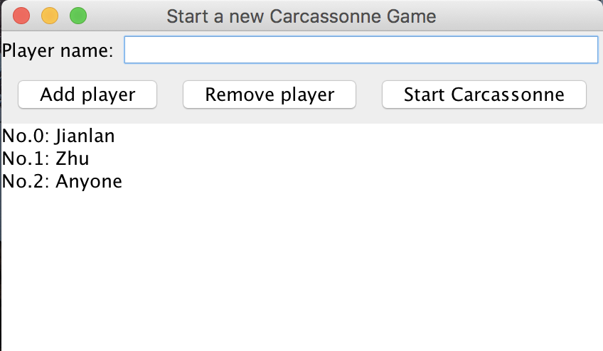
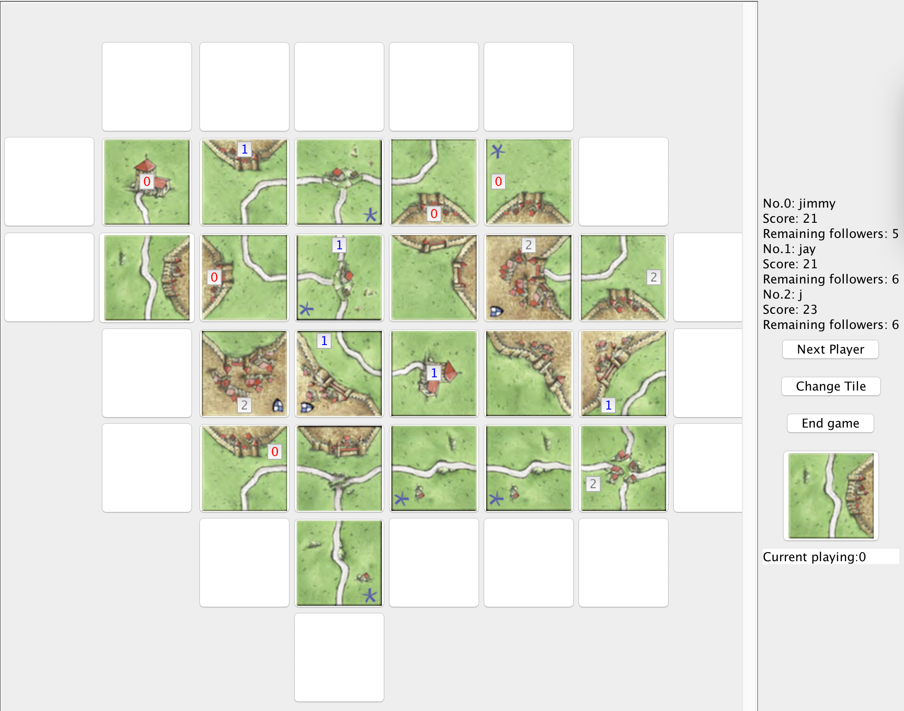

# Carcassonne Game Design

This project is the implementation of game Carcassonne. Here is the game introduction: https://en.wikipedia.org/wiki/Carcassonne

## Getting Started

This project is mainly about the logistics implementation of game Carcassonne. There are 3 main folders for this project.

1. core
* _**GameController.java**_: mainly handles all kinds of users interactions   with the game and  players' score calculation
* _**BoardController.java**_: mainly handles tile operations, like place tiles and followers

2. parameter:
* _**Rules.java**_: some game rules and common used methods
* _**SegmentType.java**_: possible types of segment

3. element:
* _**bean/TileBean.java**_: tile class's bean version. Used to initialize Tile class.
* _**Player.java**_: this class represents players
* _**Segment.java**_: this class represents segments
* _**Tile.java**_: this class represents tiles

4. gui:
* _**GamePanel.java**_: the panel where the game is played.
* _**SinglePlayerPanel.java**_: the panel including a player's game information.
* _**StartGameClient.java**_: the panel to add and remove players to the game.

5. Carcassonne.java: main method to start the game

How to play this game:

1. add/remove players to the game
  
  When the game is run, you will first see the following page.

  

  On this page, you can input any player name you like and click "Add player". Then you can see the player you added to Carcassonne in the text area down there. You can add up to 5 players.

  If you want to remove a player, you could input the player ID (in this picture, you could enter 0, 1 or 2) and then click on "Remove player". Then you will not see the player in the text area any more and the player is removed from game.

  When you finish adding players, click on "Start Carcassonne" and the game is on.

2. play Carcassonne

  The game page will look like this.

  

  At the beginning, there is only one tile with 4 white white button around it. The white button are where players could place tile. If you click on anywhere else when placing tile, the game won't response you. If you click on where the tile cannot fit, you will get a warning and you are asked to replace tile.

  The tile given to you at your turn is shown right there. If you want to rotate it, you can click on the image to to that.

  After you place a tile successfully, you can decided whether to place follower on the tile. You can click on the border of the tile or center. When the place you choose is not valid, you will get a warning. After you place the follower, you can click on "Next player" to calculate score and switch to the next player. If you do not place tile and click on "Next player", you will get a warning asking you to place tile.

  The "Change Tile" button is used to gain another tile when the user think there is no place that the given tile could fit. Here I did not check that, users can change tile as long as they want.

  For checking's convenience, I added a "End Game" button for you to use. In the above picture I have clicked on that and the message saying that j is the winner is not shown here. You can check on the image whether the score is calculated correctly if you want.

## Built With

* [Gradle](https://gradle.org) - Dependency Management 

## Authors

* **Jianlan Zhu** - *Initial work*  

Email: jianlanz@andrew.cmu.edu
